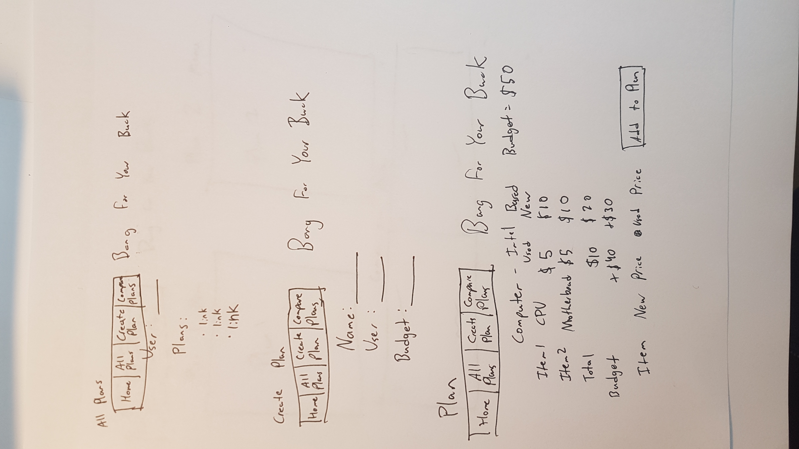
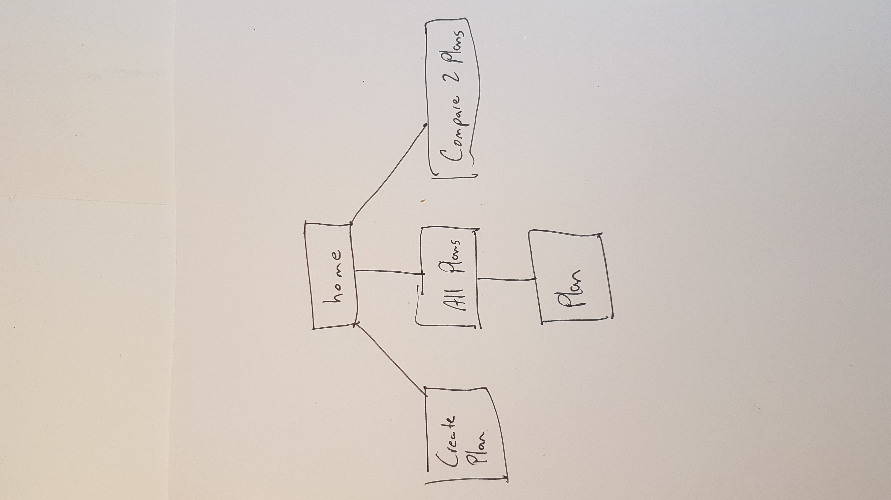

# Bang for your Buck - [Link to Deployed Application](https://bang-for-your-buck.herokuapp.com/)

## Overview

Projects (building computers, assembly a camera kit, carpentry) often require multiple different materials that must work together for the project to work. Sometimes deciding between different options while on a budget can be difficult. Keeping track of how much money you can spend, while trying to get the best value out of the products you are considering is a lot of factors to keep track of.

Bang for your Buck is a web application that will allow users to create multiple plans and compare them to each other. Users can register and login. Once logged in, they can create or view their plans and other users' plans within the shared database. Each plan has properties that keep track of the costs of each item and the total cost. Each plan also has pros/cons area for keeping track of the differences between your options. Items can be added and removed from the plans.


## Data Model

The application will store Users, Plans and Items

* users can view and edit the shared plans
* each plan can have multiple items


An Example User:

```javascript
{
  userName: "Sean"
  hash: //password
}
```

An Example List with Embedded Items:

```javascript
{
  name: "Option1",
  budget: "500"
  items: [
    { name: "item1", newCost: "5", usedCost: "5", quantity: "5"},
    { name: "item2", newCost: "5", usedCost: "5", quantity: "5"},
  ],
  note: "Good vs. Bad"
}
```


## [Link to Schema](src/db.js) 


## Wireframes




## Site map


## User Stories or Use Cases

1. as non-registered user, I can register a new account with the site
2. as a user, I can log in to the site
3. as a user, I can create a new plan
4. as a user, I can view all of the plans I've created in comparison
5. as a user, I can add items to an existing plan
6. as a user, I can remove items from a plan
7. as a user, I can add notes to each plan explaining costs/benefits
8. as a user, I can view how much my budget can support

## Additional Components

* Integrate user authentication
    * I'm going to be using passport for user authentication
* Perform client side form validation using a JavaScript library

## Annotations / References Used

1. [passport.js authentication docs](http://passportjs.org/docs)

2. [Simple Form Validation](https://www.elated.com/articles/form-validation-with-javascript/)

3. [Simple Form Validation](https://www.w3schools.com/js/js_validation.asp)

4. [tutorial on passport](https://code.tutsplus.com/tutorials/authenticating-nodejs-applications-with-passport--cms-21619)

5. [tutorial on passport](https://scotch.io/tutorials/easy-node-authentication-setup-and-local)

6. [Understanding Passport Authentication Flow](http://toon.io/understanding-passportjs-authentication-flow/)
